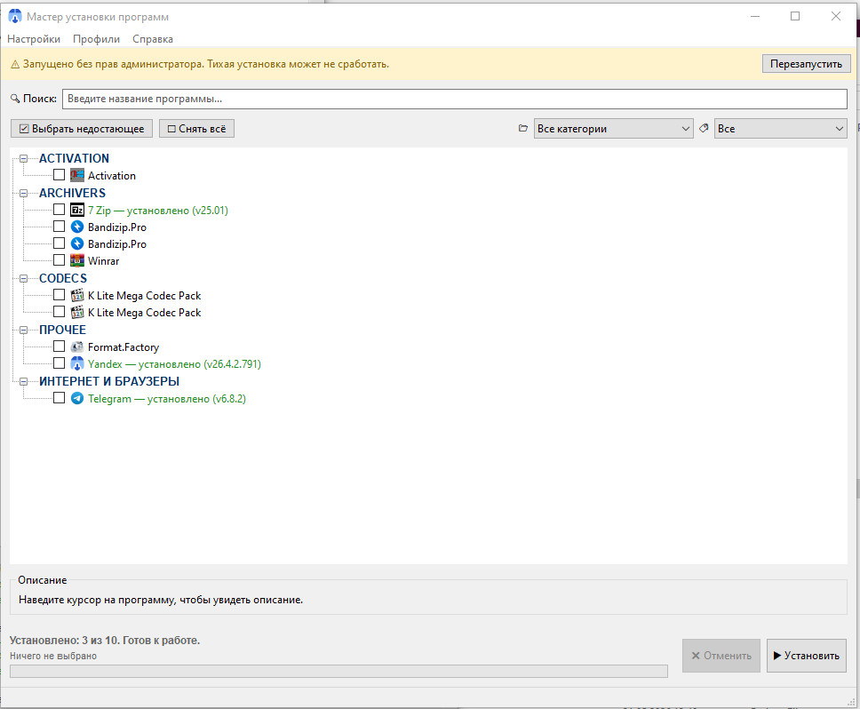
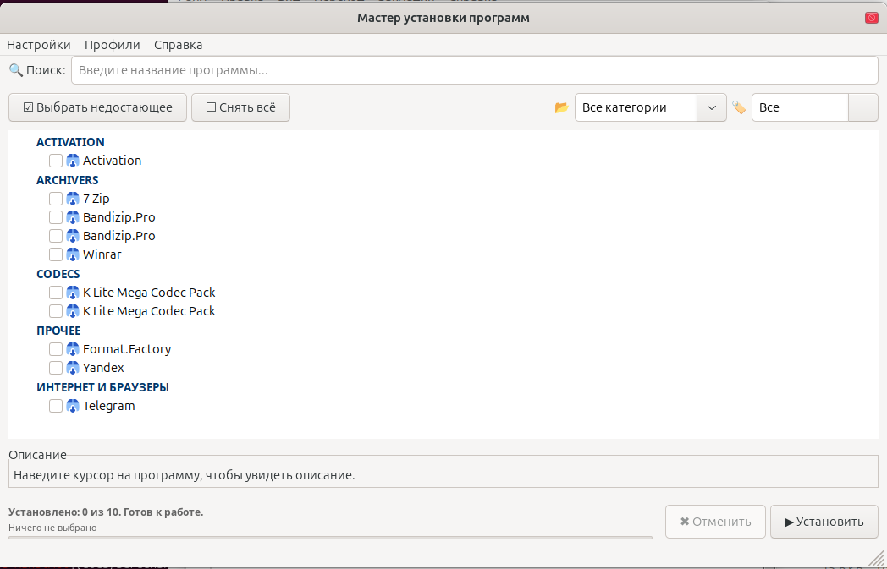

# MInstAll

Универсальный мастер тихой установки программ и системных твиков.
Кросс-платформенный: **Windows** и **Linux**.

Автоматизирует развёртывание рабочего окружения:

- **Windows** — `.exe`, `.msi`, `.bat`/`.cmd`, `.reg`, PowerShell-скрипты
- **Linux** — `.deb` (через `apt-get`), `.sh`/`.bash`, `.AppImage`

---

## Скриншоты

**Windows**



**Linux**



---

## Скачать

### Windows

[**Последний релиз**](https://github.com/assassins377/Python_Install/releases/latest) → `MInstAll_x86.exe`

Файл работает на Windows 7 и выше (32-bit, совместим со всеми Windows-системами).

### Linux

Готового бинарника нет — запускается из исходников (см. [Запуск из исходников](#запуск-из-исходников)).

### Проверка целостности

После скачивания сравни SHA-256 файла с указанным в описании Release:

```powershell
# Windows
Get-FileHash MInstAll_x86.exe -Algorithm SHA256
```

```bash
# Linux
sha256sum MInstAll_x86.exe
```

## ⚠ Предупреждение SmartScreen (только Windows)

При первом запуске Windows может показать:

> **Защитник Windows SmartScreen предотвратил запуск неопознанного приложения**

**Это нормально.** Приложение пока без code-signing сертификата (стоит ~$200/год — пока не оправдано).

### Как запустить

1. На предупреждении нажми **"Подробнее"**
2. Появится кнопка **"Выполнить в любом случае"** — нажми её

После нескольких запусков (или ~3000 загрузок по всем пользователям) Microsoft автоматически добавит репутацию и предупреждение пропадёт.

### Почему стоит доверять

- Открытый исходный код — можешь сам проверить что делает программа
- Сборка идёт через GitHub Actions из этого же репозитория, не вручную
- SHA-256 публикуется в описании каждого Release — можешь проверить целостность

---

## Возможности

- **Пакетная тихая установка** — выбираешь набор программ, нажимаешь "Установить", идёшь пить чай
- **Детекция установленного** — не ставит повторно:
  - Windows — через реестр
  - Linux — через `dpkg-query`
- **Системные компоненты** — .NET Framework 4.8, DirectX, Visual C++ Redistributables (Windows)
- **Зависимости** — топологическая сортировка (например, VC++ ставится до зависящих приложений)
- **Параллельная установка** — независимые программы ставятся одновременно (`--parallel`)
- **Retry с backoff** — повтор при retryable ошибках (1618, 1603, 1641)
- **Откат при ошибке** — если установка не удалась, запускается uninstall-команда
- **Watchdog** — детекция зависших инсталляторов по CPU и принудительное завершение
- **Скачивание по URL** — с проверкой SHA-256 и контролем редиректов
- **Автообновление** — проверяет новую версию через GitHub Releases (Windows)
- **Профили** — готовые наборы программ (`--install-profile`)
- **CLI-режим** — установка без GUI (`--install`, `--list`, …)
- **Локализация** — русский, английский и др. (`i18n/`)
- **Сохранение размера окна** — позиция и размер запоминаются между запусками

### Повышение прав

- **Windows** — UAC-диалог (`runas`)
- **Linux** — `pkexec` с пробросом окружения, fallback на `sudo -E`

---

## Запуск из исходников

```bash
# Linux
git clone https://github.com/assassins377/Python_Install.git
cd Python_Install
pip install -r requirements.txt
python main.py
```

```powershell
# Windows
git clone https://github.com/assassins377/Python_Install.git
cd Python_Install
pip install -r requirements.txt
python main.py
```

### CLI (без GUI)

```bash
python main.py --version
python main.py --list
python main.py --list --filter-status missing
python main.py --install "Google Chrome,Telegram Desktop"
python main.py --install-profile developer
python main.py --install all --missing-only --parallel
python main.py --install Chrome --dry-run
```

## Тесты

```bash
python -m pytest tests/ -v
```

## Сборка .exe локально (Windows)

```powershell
pip install pyinstaller
pyinstaller --clean --noconsole --onefile --name MInstAll_x86 --icon=icons/system.png main.py
```

## Структура проекта

```
├── main.py              # Точка входа + разбор CLI-аргументов
├── cli.py               # CLI-режим (установка/списки без GUI)
├── config.py            # Константы, пути, версия
├── core.py              # Утилиты: пути, валидация/сборка команд, скачивание
├── installer.py         # InstallWorker: запуск, retry, watchdog, откат, хуки
├── registry.py          # Детекция установленного (реестр / dpkg), статусы, версии
├── deps.py              # Разрешение зависимостей, топологическая сортировка
├── gui.py               # wxPython-окно (сборка из миксинов)
├── tree.py              # Дерево программ, контекстное меню
├── menu.py              # Меню приложения, переключатели настроек
├── dispatch.py          # Связь GUI ↔ InstallWorker, финализация установки
├── log_panel.py         # Панель лога в GUI
├── icons.py             # Иконки (извлечение из .exe на Windows)
├── i18n.py + i18n/      # Локализация
├── profiles.py          # Профили (готовые наборы программ)
├── scanner.py           # Автообнаружение инсталляторов в software/
├── stats.py             # Статистика времени установки
├── state.py             # Сохранение настроек/сессии
├── updater.py           # Автообновление через GitHub (Windows)
├── programs.json        # Каталог программ
├── version.json         # Метаданные текущей версии
├── tests/               # Unit-тесты
├── tools/               # Утилиты (scan_software.py, import_winget.py)
├── icons/               # Иконки
├── software/            # Инсталляторы (локально, не в репозитории)
└── .github/workflows/   # CI: тесты + сборка + Release
```

## Лицензия

GNU GPL v3 — см. [LICENSE](LICENSE).
